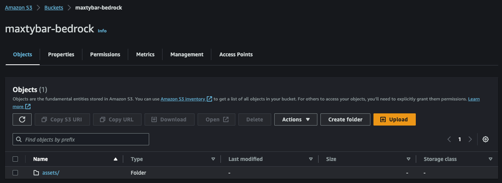
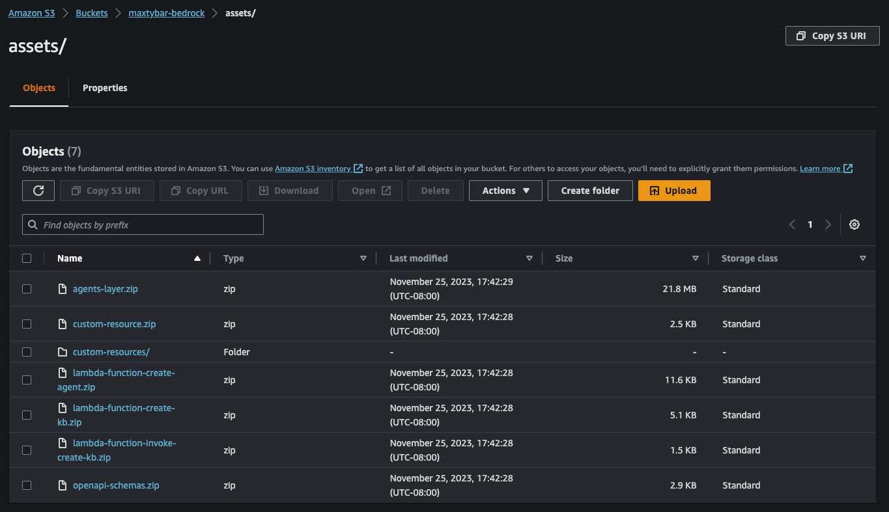
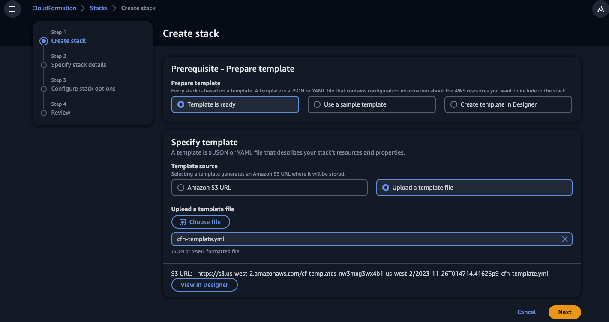
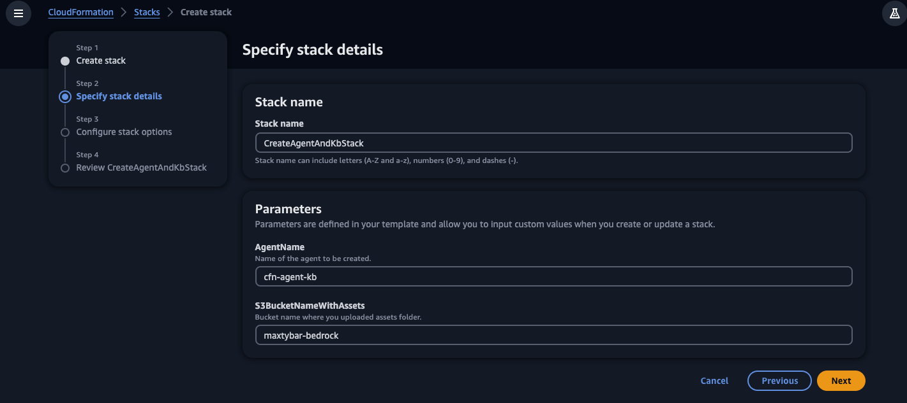
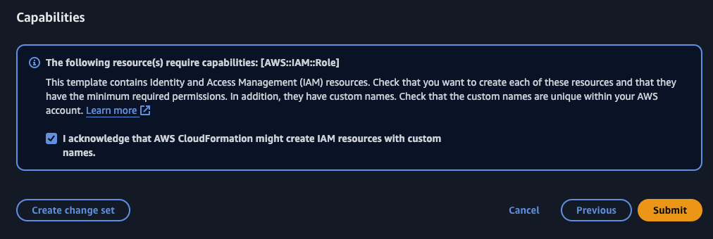

# AWS CloudFormation Deployment

The following tutorial assumes that you have an AWS account and have Administrator Access role to deploy the CloudFormation.

# Installation:

1. Create S3 bucket and note its name.
2. Download [this](./assets/) folder and upload it to the S3 bucket that you just created. It is important that you upload the folder to S3 bucket as it is (root folder should be ``assets``), i.e. if your S3 bucket name is ``my-bucket-name`` then you should upload ``assets`` folder so the full path looks like ``my-bucket-name/assets``.





3. Download [this](cfn-template.yml) CloudFormation template.
4. [Navigate](https://us-west-2.console.aws.amazon.com/cloudformation/home?region=us-west-2#) to the AWS CloudFormation console. You can also change your region to ``us-east-1`` if desired.
5. Click ``Create stack`` at the top right and select ``With new resources (standard)`` from the dropdown menu. 


6. Click ``Upload a template file`` and select the CloudFormation template that you downloaded in step 3. Click ``Next``.



7. Put a stack name and an agent name that you want your agent to have. **Keep your agent name length under 20 characters**. 
Provide S3 bucket name that you created in step 1. Click ``Next`` on the current page as well as the next page.



8. Scroll all the way down to the bottom page, tick in the acknowledge box and click ``Submit``.



# After intallation

A few steps to be completed after you deployed the infrastructure.

1. In the ``Outputs`` tab note ``S3BucketNameParameter`` bucket name that you would need to use in your prompt.

2. In the console navigate to [Amazon Bedrock Agents](https://us-west-2.console.aws.amazon.com/bedrock/home?region=us-west-2#/agents). Select agent with the name that you provided. If you did not provide a name, the defaul name will be ``cfn-agent-reInvent``. In agent overview panel select ``Edit``:

<div align="center">

</div>

3. Click ``Yes`` in ``User input`` panel. In the bottom right click ``Save``.

<div align="center">

</div>

4. In the agent overview click ``Create Alias``.

<div align="center">

</div>

5. Give your alias a name and click ``Create Alias``.

<div align="center">

</div>

6. On the right side click ``Prepare``. This will "update" your agent's state.

<div align="center">

</div>

7. After agent is prepared click on the "expand" button in the top right.

<div align="center">

</div>

8. Make sure you select the alias' name that you just created in the top dropdown menu. After that you can interacting with your agent.

<div align="center">

</div>

# Prompt example

Feel free to experiment with the propmt. However, results might be unpredictable.

```
Give me a new agent called hello-world. Save the artifacts in my S3 bucket, named 'agent-452-artifacts-bucket'. 
The agent should have one action called hello that takes no inputs and gives back a string with the value 'hello world!'. 
Use this instruction for the new agent: 'You return Hello World whenever user asks you to call the function'.
```

To delete the resources simply delete the CloudFormation stack.