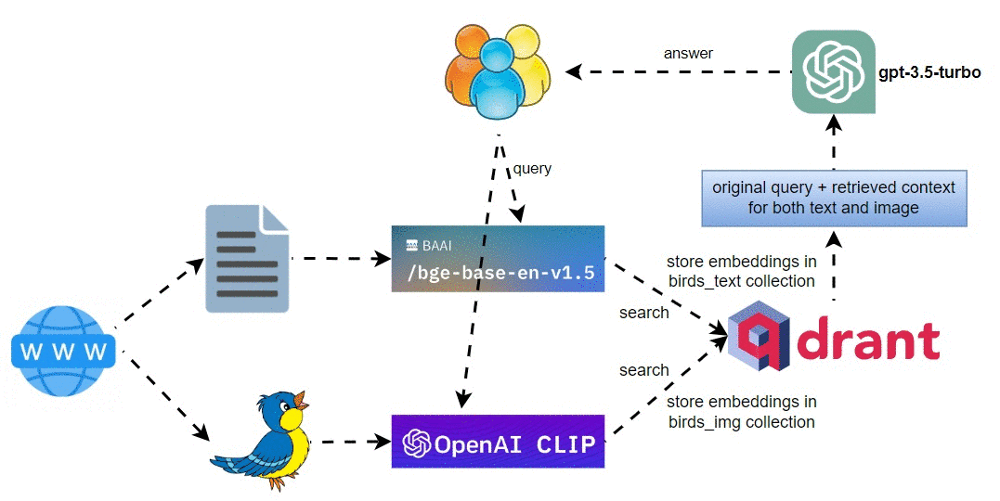

# multi_modal_retrieval_backyard_birds

A little app I created for my daughter who loves birds. :-)

## Implementation Steps
* Step 1: Download backyard birds text and images
* Step 2: Build text index for vector store and define text query engine
* Step 3: Build image index for vector store using OpenAI CLIP embeddings
* Step 4: Multimodal retrieval of both image and text for sample queries
