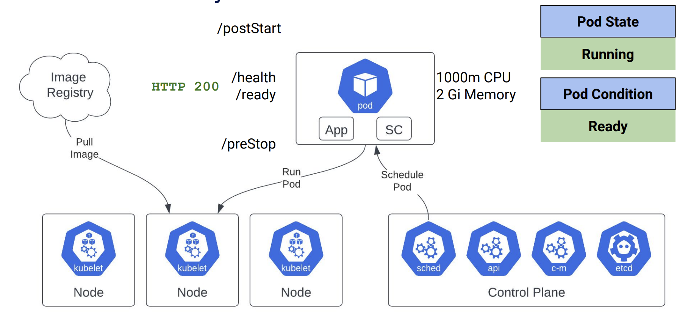

# Kubernetes Pod Lifecycle

## Pod Creation Lifecycle



### kubelet is important for pod lifecycle

Kubelet plays an essential role in the Kubernetes framework, managing and coordinating pods and nodes.
It helps the kubernetes to manage the pods, and helps it to choose which node that the new pod should be published on.

## Pod Termination Lifecycle

When a Pod is terminated, Kubernetes performs the following steps:

- Pod is set to the “Terminating” State and removed from the endpoints list of all Services
- preStop Hook is executed, if configured
- SIGTERM signal is sent to the pod
- Application should gracefully shutdown
- Kubernetes waits for a grace period (default 30 seconds)
- SIGKILL signal is sent to Pod (if still running)
- Pod is deleted

### Graceful shutdown

For the graceful shutdown, K8S uses SIGTERM.
So, you need to make sure that your application supports the SIGTERM handling for graceful shutdown.

Below are options for several popular frameworks.

FastAPI:

- SIGTERM will not work if you put either "--worker" or "--reload" option to uvicorn
    - Of course, no one use "--reload" for multi server production environment
    - Rather than using "--worker", try to increase the pods if you use K8S

Java Spring:

- "server.shutdown=graceful"
    - This implements SIGTERM signal handling.

Node.js:

- Implement a custom SIGTERM handler

### Lifecycle preStop Hook

- Graceful shutdown preferable
- Workaround when can’t change code to implement graceful shutdown
    - No change needed in code
    - Add pre-stop hook and sleep more than ALB keep alive timeout

```yaml
containers:
 - name: app
 image: docker.example.com...
 livenessProbe:
 ...
 readinessProbe:
 ...
+ lifecycle:
+ preStop:
+ exec:
+ command: ["/bin/sleep","60"]
+ terminationGracePeriodSeconds: 62
```

## Common problems with pod lifecycles

Please refer [here](./troubleshooting/common_pod_lifecycle_problems.md)

## References

- [Kubernetes best practices: terminating with grace](https://www.youtube.com/watch?v=Z_l_kE1MDTc)
