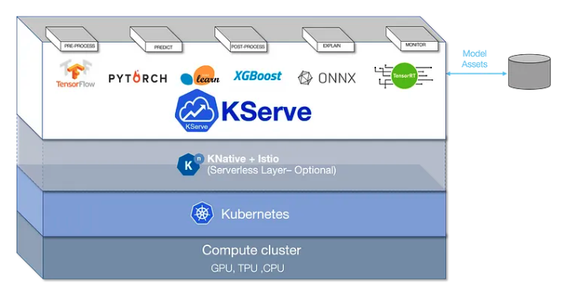

# KServe

KServe is a highly scalable machine learning deployment toolkit for Kubernetes.
It is an orchestration tool that is built on top of Kubernetes and leverages two other open sourced projects, Knative-Serving and Istio.

KServe significantly simplifies the deployment process of ML Models into a Kubernetes cluster by unifying the deployment into a single resource definition.
It makes the machine learning deployment part of any ML project easy to learn and ultimately decreases the barrier to entry.
Therefore, models deployed using KServe can be easier to maintain than models deployed using traditional Kubernetes deployment that require a Flask or FastAPI service.

With KServe, there is no requirement to wrap your model inside a FastAPI or Flask app before exposing it through the internet via HTTPS.
KServe has built-in functionality that essentially replicates this process but without the overhead of having to maintain API endpoints, configure pod replicas, or configure internal routing networks in Kubernetes.
All you have to do is point KServe to your model, and it will handle the rest.

## Istio

Much of the functionality that KServe brings to the table would be difficult without Istio.
Istio is a service mesh that extends your applications deployed in Kubernetes.
It is a dedicated infrastructure layer that adds capabilities such as observability, traffic management, and security.
For those familiar with Kubernetes, Istio replaces the standard ingress definitions typically found in a Kubernetes cluster.

The complexity of managing traffic and maintaining observability grows as a Kubernetes-based system scales.
One of the best features of Istio is its ability to centralize the controls of service-level communications.
This gives developers greater control and transparency over communications among services.

With Istio, developers do not need to design applications that can handle traffic authentication or authorization.
Ultimately, Istio helps reduce the complexity of deployed apps and allows developers to concentrate on the important components of the apps.

## KNative

Knative, on the other hand, is an open-source enterprise-level solution to build serverless and event-driven applications.
Knative is built on top of Istio to bring serverless code execution capabilities that are similarly offered by AWS Lambdas and Azure Functions.
Knative is a platform-agnostic solution for running serverless deployments in Kubernetes.

KServe will be ideal in organisations already leveraging Kubernetes where there are existing knowledge in working with Kubernetes.
It may also suit organisations looking to move away or complement managed services like SageMaker or Azure Machine Learning in order to have greater control over your model deployment process.
The increase in ownership can result in significant cost reductions and increased configurability to meet project specific requirements.
