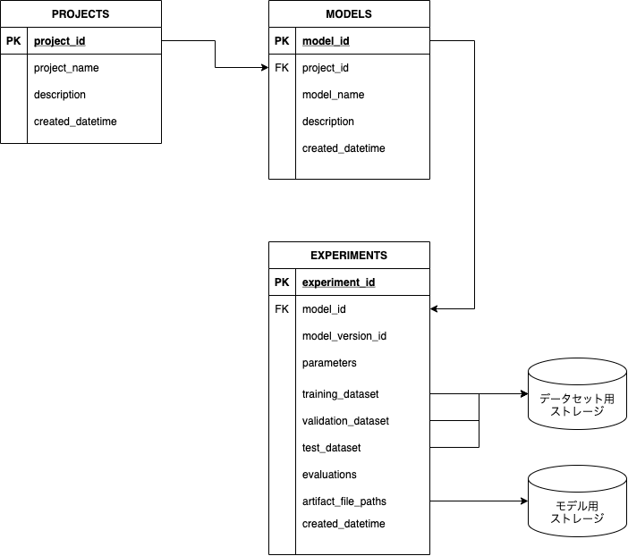

# Model Management DB

## Main Aim

Construct a REST API for managing models and a database for storing models.
Below is the architecture of the model management db.



## Pre-requisites

- Python 3.8 or later
- Docker
- Docker compose

## Running Instruction

```sh
$ make build
```

2. Docker compose 로 모델 DB 기동

```sh
$ make dc_up
# 실행 커맨드
# docker-compose \
#     -f ./docker-compose.yml \
#     up -d
```

3. 모델 DB 서비스 기동 확인

10초 정도 안에 기동됩니다.
브라우저에서 `localhost:8000/docs` 를 열고, Swagger 가 기동하는지 확인합니다. 


4. 모델 DB 서비스 정지

```sh
$ make c_down
# 실행 커맨드
# docker-compose \
#     -f ./docker-compose.yml \
#     down
```
